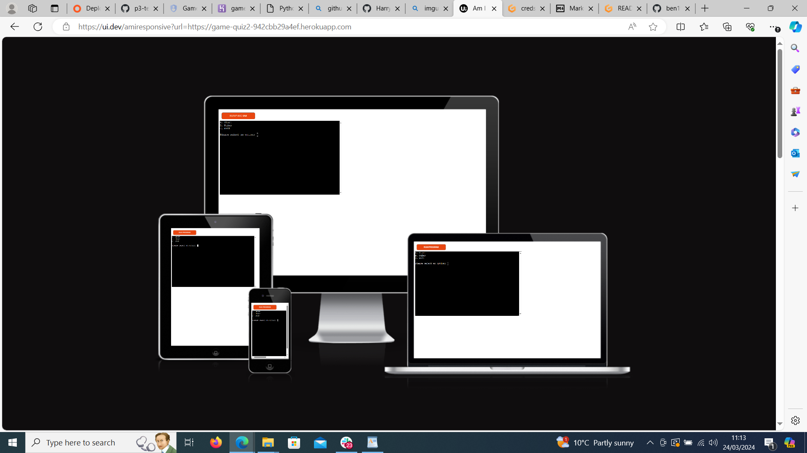
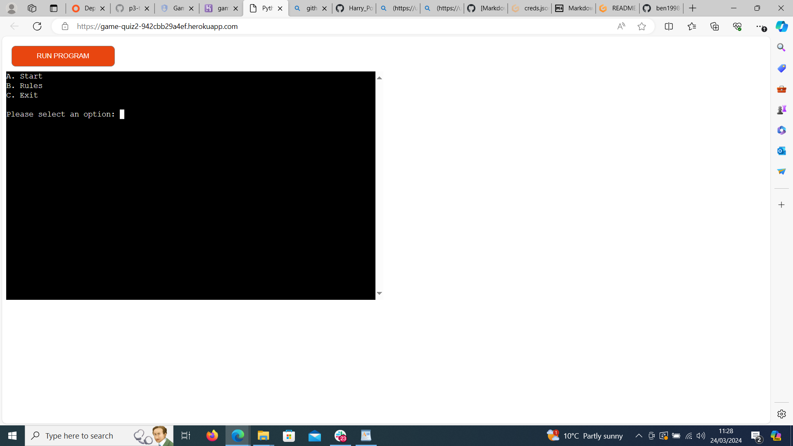

# [GAME QUIZ2](https://game-quiz2-942cbb29a4ef.herokuapp.com)

[](https://github.com/ben1998-hub/Game-Quiz2/commits/main)
[](https://github.com/ben1998-hub/Game-Quiz2/commits/main)
[](https://github.com/ben1998-hub/Game-Quiz2)


Hi there my name is Ben I made this quiz game to have fun for myslef and others.



> [!NOTE]  
> BLUE: This is A game have fun with it.

> [!TIP]  
> GREEN: there only four choice to chose from so that means three answers are incorrect.

> [!IMPORTANT]  
> PURPLE: Take your time there is no time limit here!.

> [!WARNING]  
> YELLOW: The only thing to warn users about is they'ed wish there was more questions.

> [!CAUTION]  
> RED: If you get an answer wrong to be to hard on yourself just try agian.

Source: https://github.com/orgs/community/discussions/16925


## Features


The features in this quiz menu selctor, multi choice question and rules explaing the game.





### Future Features

I was thinking a good future feature would be to have the answers clickable not just typed user input.


## Tools & Technologies Used


- [](https://tim.2bn.dev/markdown-builder) used to generate README and TESTING templates.

- [](https://github.com) used for secure online code storage.

- [](https://gitpod.io) used as a cloud-based IDE for development.

- [](https://code.visualstudio.com) used as my local IDE for development.


-
- [](https://www.python.org) used as the back-end programming language.
- 
- [](https://pages.github.com) used for hosting the deployed front-end site.
- [](https://www.heroku.com) used for hosting the deployed back-end site.

- [](https://dbs.ci-dbs.net) used as the Postgres database from Code Institute.


- [](https://whitenoise.readthedocs.io) used for serving static files with Heroku.


- [](https://chat.openai.com) used to help debug, troubleshoot, and explain things.

## Data Model


### Classes & Functions

The program uses classes as a blueprint for the project's objects (OOP). This allows for the object to be reusable.

```python
class Person:
    """ Insert docstring comments here """
    def __init__(self, name, age, health, inventory):
        self.name = name
        self.age = age
        self.health = health
        self.inventory = inventory
```

The primary functions used on this application are:
=print()
- def()
-else()
- `main()`
    - Run all program functions.


## Testing

> [!NOTE]  
> For all testing, please refer to the [TESTING.md](TESTING.md) file.

## Deployment

Code Institute has provided a [template](https://github.com/Code-Institute-Org/python-essentials-template) to display the terminal view of this backend application in a modern web browser.
This is to improve the accessibility of the project to others.

The live deployed application can be found deployed on [Heroku](https://game-quiz2-942cbb29a4ef.herokuapp.com).

### Heroku Deployment

This project uses [Heroku](https://www.heroku.com), a platform as a service (PaaS) that enables developers to build, run, and operate applications entirely in the cloud.

Deployment steps are as follows, after account setup:

- Select **New** in the top-right corner of your Heroku Dashboard, and select **Create new app** from the dropdown menu.
- Your app name must be unique, and then choose a region closest to you (EU or USA), and finally, select **Create App**.
- From the new app **Settings**, click **Reveal Config Vars**, and set the value of KEY to `PORT`, and the value to `8000` then select *add*.
- If using any confidential credentials, such as CREDS.JSON, then these should be pasted in the Config Variables as well.
- Further down, to support dependencies, select **Add Buildpack**.
- The order of the buildpacks is important, select `Python` first, then `Node.js` second. (if they are not in this order, you can drag them to rearrange them)

Heroku needs three additional files in order to deploy properly.

- requirements.txt
- Procfile
- runtime.txt

You can install this project's **requirements** (where applicable) using:

- `pip3 install -r requirements.txt`

If you have your own packages that have been installed, then the requirements file needs updated using:

- `pip3 freeze --local > requirements.txt`

The **Procfile** can be created with the following command:

- `echo web: node index.js > Procfile`

The **runtime.txt** file needs to know which Python version you're using:
1. type: `python3 --version` in the terminal.
2. in the **runtime.txt** file, add your Python version:
	- `python-3.9.18`

For Heroku deployment, follow these steps to connect your own GitHub repository to the newly created app:

Either:

- Select **Automatic Deployment** from the Heroku app.

Or:

- In the Terminal/CLI, connect to Heroku using this command: `heroku login -i`
- Set the remote for Heroku: `heroku git:remote -a app_name` (replace *app_name* with your app name)
- After performing the standard Git `add`, `commit`, and `push` to GitHub, you can now type:
	- `git push heroku main`

The frontend terminal should now be connected and deployed to Heroku!

### Local Deployment

This project can be cloned or forked in order to make a local copy on your own system.

For either method, you will need to install any applicable packages found within the *requirements.txt* file.

- `pip3 install -r requirements.txt`.

If using any confidential credentials, such as `CREDS.json` or `env.py` data, these will need to be manually added to your own newly created project as well.

#### Cloning

You can clone the repository by following these steps:

1. Go to the [GitHub repository](https://github.com/ben1998-hub/Game-Quiz2) 
2. Locate the Code button above the list of files and click it 
3. Select if you prefer to clone using HTTPS, SSH, or GitHub CLI and click the copy button to copy the URL to your clipboard
4. Open Git Bash or Terminal
5. Change the current working directory to the one where you want the cloned directory
6. In your IDE Terminal, type the following command to clone my repository:
	- `git clone https://github.com/ben1998-hub/Game-Quiz2.git`
7. Press Enter to create your local clone.

Alternatively, if using Gitpod, you can click below to create your own workspace using this repository.

[](https://gitpod.io/#https://github.com/ben1998-hub/Game-Quiz2)

Please note that in order to directly open the project in Gitpod, you need to have the browser extension installed.
A tutorial on how to do that can be found [here](https://www.gitpod.io/docs/configure/user-settings/browser-extension).

#### Forking

By forking the GitHub Repository, we make a copy of the original repository on our GitHub account to view and/or make changes without affecting the original owner's repository.
You can fork this repository by using the following steps:

1. Log in to GitHub and locate the [GitHub Repository](https://github.com/ben1998-hub/Game-Quiz2)
2. At the top of the Repository (not top of page) just above the "Settings" Button on the menu, locate the "Fork" Button.
3. Once clicked, you should now have a copy of the original repository in your own GitHub account!


## Credits
https://realpython.com/python-quiz-application/
https://www.youtube.com/watch?v=zehwgTB0vV8
And most importantly mentor Tim!!


### Content


| Source | Location | Notes |
| --- | --- | --- |
| [Markdown Builder](https://tim.2bn.dev/markdown-builder) | README and TESTING | tool to help generate the Markdown files |
| [Chris Beams](https://chris.beams.io/posts/git-commit) | version control | "How to Write a Git Commit Message" |


| [Flexbox Froggy](https://flexboxfroggy.com/) | entire site | modern responsive layouts |
| [StackOverflow](https://stackoverflow.com/a/2450976) | quiz page | Fisher-Yates/Knuth shuffle in JS |
| [YouTube](
https://realpython.com/python-quiz-application/) | leaderboard | using `localStorage()` in JS for high scores |
| [YouTube](https://www.youtube.com/watch?v=zehwgTB0vV8) | PP3 terminal | tutorial for adding color to the Python terminal |
| [strftime](https://strftime.org) | CRUD functionality | helpful tool to format date/time from string |
| [WhiteNoise](http://whitenoise.evans.io) | entire site | hosting static files on Heroku temporarily |


### Acknowledgements


- I would like to thank my Code Institute mentor, [Tim Nelson](https://github.com/TravelTimN) for his support throughout the development of this project.
- I would like to thank the [Code Institute](https://codeinstitute.net) tutor team for their assistance with troubleshooting and debugging some project issues.
- I would like to thank the [Code Institute Slack community](https://code-institute-room.slack.com) for the moral support; it kept me going during periods of self doubt and imposter syndrome.
- I would like to thank my partner (John/Jane), for believing in me, and allowing me to make this transition into software development.
- I would like to thank my employer, for supporting me in my career development change towards becoming a software developer.
-I would also like to state that i came in to a lot of problems with this project for example my frist time having a go at this i used the wrong developer tools then the second time i did'nt used the CI template, I also ran out of time to do a TESTING.md file becasue i had trouble getting access to herkuo only 4 days ago but. i did get into contact with the stundent care about this and ask for a exstenshion but did receive a respons with this i also spoke with my mentor Tim about this he was a lot of help. thanks i hope you enjoyed the quiz.